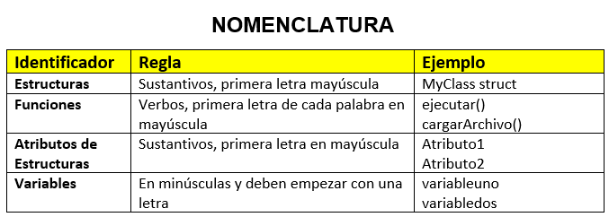

*Universidad de San Carlos de Guatemala*  
*Escuela de Ingeniería en Ciencias y Sistemas, Facultad de Ingenieria*  
*Estructuras de Datos, 1er. Semestre 2023.*  

___
## **PROYECTO FASE 1**
### **EDD GoDrive**
___
**201944994 - Robin Omar Buezo Díaz**  

#### **Resumen**
Esta aplicación está desarrollado por requerimientos de la Facultad de Ingeniería de la Universidad de San Carlos de Guatemala.

Estos requerimientos consisten en un sistema que pueda utilizarse en cualquier sistema operativo y que consista en un sistema de archivos y almacenamiento que pueda llevar un control de sus usuarios los cuales podran crear, eliminar o actualizar archivos y carpetas que estén relacionados a los distintos cursos.
___
#### **Introducción**  
El presente documento tiene como finalidad mostrar al usuario la funcionalidad y desarrollo del software para que entienda su construcción y pueda dar solución a cualquier error que pueda presentarse.  

Se explican el flujo y las diferentes partes que lo constituyen y cómo debemos de interactuar con este para que nos sea de gran ayuda y podamos sacarle el máximo provecho a nuestra herramienta.

#### **Paradigma de Programación**
Para la creación se este software se utilizó el paradigma de Programación Orientada a Objetos, ya que esto da una mejor facilidad a la hora de manejar el archivo que se está manipulando a lo largo de toda la ejecución, como también el poder encapsular los objetos y luego poder utilizar los mismos objetos en los diferentes menús que se utilizan a lo largo del programa.

Para el encapsulamiento se hizo uso de "*Structs*" ya que nuestro lenguaje de programación hace uso de clases.  

#### **Nomenclatura**  
  

#### **Estructuras (TDA)**  
Para poder ir guardando la información necesaria en el sistema se hizo uso de algunas Estructuras, estas fueron creadas a lo largo de desarrollo haciendo uso de un "*Struct*" que encapsulan los nodos de cada una de estas y otro que encapsula a la propia estructura. 

Entre las Estructuras utilizados están:
- Una Lista Doblemente Enlazada. 
- Una cola.  
- Una Pila.
- Una Lista de Pilas.

##### ***Nodo de Lista Doble y Cola (NodeUser)***
Este nodo se utilizó para poder formar e iterar la lista Doble Enlazada de estudiantes y la cola de espera del sistema.

Su "*Struct*" es el siguiente:

~~~
type NodeUser struct {
	User     *User
	Next     *NodeUser
	Prev     *NodeUser
	Binnacle *StackBinnacle
}
~~~

##### ***Nodo de Pila (NodeAction)***
Este nodo se utilizo para poder formar e iterar las pilas de bitácora tanto de los estudiantes como del administrador.

Su "*Struct*" es el siguiente:

~~~
type NodeAction struct {
	action string
	time   string
	Next   *NodeAction
}
~~~

##### ***Lista Doble Enlazada (DouListUsers)***
Este "*Struct*" se utilizó para poder manipular los nodos de Usuarios y así poder crear la Lista Doble Enlazada.

Su "*Struct*" es el siguiente:

~~~
type DouListUsers struct {
	first *NodeUser
	last  *NodeUser
}
~~~

##### ***Cola (QueueUsers)***
Este "*Struct*" se utilizó para poder manipular los nodos de Usuarios y así poder crear la Cola de espera para ser aceptados o rechazados del sistema.

Su "*Struct*" es el siguiente:

~~~
type QueueUsers struct {
	first *NodeUser
	Size  int
}
~~~

##### ***Pila (StackBinnacle)***
Este "*Struct*" se utilizó para poder manipular los nodos de Acciones y así poder crear las Pilas que se usuaron para llevar el control de las bitácoras de los usuarios.

Su "*Struct*" es el siguiente:

~~~
type StackBinnacle struct {
	first *NodeAction
}
~~~

Cabe mencionar que cada una de estas Estructuras cuentan con sus funciones propias para poder *insertar datos, buscar, ordenar *e* imprimir*.

Ademas de estas estructuras tenemos otra que se encarga de guardar los datos de los usuarios.

#### **Funciones Principales**
Entre las funciones Principales contamos con las siguientes:  

##### ***Login()***
Esta función es la que se encarga del manejo de los menús y practicamente es donde se desarrolla todo el flujo de la aplicación.

##### ***WriteDotFile()***
Esta función es la que se encarga de la creación del archivo *".dot"* del que luego se genera el archivo *".png"* de los reportes que son los grafos de las estructuras.

Cabe mencionar que cada una de las estructuras cuenta con su función para generar el codigo para graficar.

##### ***GeneratePNG()***
Esta función es la que se encarga de tomar el archivo *".dot"* y generar en base a este el archivo *".png"* en donde se visualiza el grafo.

##### ***WriteJSONFile()***
Esta función es la que se encarga de la creación del archivo *".json"* en base a los datos de los usuarios que están en la Lista Doble Enlazada.

##### ***ReadCSVFile()***
Esta función es la que se encarga de la lectura del archivo *".csv"* con el cual se genera la carga masiva de estudiantes a la cola de espera para ser aceptados o rechazados del sistema.

##### ***GraphCode()***
Las Estructuras de Datos, además de sus funciones principales también cuentan con está función que se encarga de generar el codigo de Graphviz que luego será convertido a un archivo *".dot"* para posteriormente ser graficado.

#### **Herramientas**
Para poder dar solución a los requerimientos anteriores se utilizó el lenguaje de programación Go y su documentación por su versatilidad en el uso de punteros y fácil programación.  

Como herramienta de programación se utilizó el programa Visual Studio Code por su amplia funcionalidad y herramientas que brinda a los programadores a la hora de programar en cualquier lenguaje.  

Para poder realizar los diagramas y reportes se utilizó la herramienta Graphviz por su facilidad para poder desarrollar grafos potentes y entendibles.  

Para poder realizar este documento de utilizó el Lenguaje de marcado Markdown por su manera sencilla de generar documentos de escritura de facil lectura tanto en paginas web como en editores de texto.

Por último, se utilizó la herramienta de versionamiento GitHub. Para poder tener un mejor control sobre los cambios que se iban realizando en nuestro código y no tener el problema de perder funcionalidad si en caso algún cambio ocasionaba erros.

#### **Pantallas Principales**
##### ***Inicio***
Esta es la pantalla principal de inicio de sesión.
~~~
**************** EDD GoDrive ****************
*            1. Iniciar Sesion              *
*           2. Salir del Sistema            *
**************** EDD GoDrive ****************
Elige una opcion: 1

Ingresa tu usuario: admin
Ingresa tu password: admin
~~~
##### ***Dashboard del Administrador***
Esta es la pantalla principal de inicio de sesión.
~~~
*** Dashboard Administrador - EDD GoDrive ***
*      1. Ver estudiantes Pendientes        *
*      2. Ver estudiantes del Sistema       *
*      3. Registrar Nuevo Estudiante        *
*      4. Carga Masiva de Estudiantes       *
*      5. Reportes                          *
*      6. Cerrar Sesion                     *
*********************************************
Elige una opcion:
~~~
##### ***Estudiantes Pendientes***
Esta es la pantalla en donde se pueden aceptar o rechazar a lso estudiantes que están en la cola.
~~~
********** Estudiantes Pendientes ***********
*************** Pendientes: 1 ***************
* Estudiante Actual: Estudiante Prueba
*      1. Aceptar al Estudiante             *
*      2. Rechazar al Estudiante            *
*      3. Volver al Menu                    *
Elige una opcion:
~~~
##### ***Estudiantes del Sistema***
Esta es la pantalla en donde se pueden aceptar o rechazar a lso estudiantes que están en la cola.
~~~
********** Listado de Estudiantes ***********
---------------------------------------------
Nombre: Estudiante Prueba2, Carnet: 202301234
---------------------------------------------
Nombre: Estudiante Prueba, Carnet: 202302271
~~~
##### ***Registrar Nuevo Estudiante***
Esta es la pantalla en donde ingresan los datos de los estudiantes que se quieren ingresar de forma manual.
~~~
*** Registro de Estudiantes - EDD GoDrive ***
Ingresa el Nombre: Estudiante
Ingresa el Apellido: Prueba
Ingresa el Carnet: 202302271
Ingresa el Password: prueba

¡Usuario agregado a la cola!
~~~
##### ***Carga Masiva de Estudiantes***
Esta es la pantalla en donde se ingresa la ruta del archivo csv para que se carguen estudiantes de forma masiva.
~~~
*********** Carga de Estudiantes ************
Ingresa la ruta del archivo CSV: ./Pruebas/carga_masiva.csv

¡Usuario agregado a la cola!

¡Usuario agregado a la cola!

¡Usuario agregado a la cola!

...
~~~
##### ***Reportes***
Esta es la pantalla desde donde se pueden generar los reportes de cada Estructura.
~~~
***************** Reportes ******************
*      1. Generar Reporte de Estudiantes    *
*      2. Generar Reporte de Cola de Espera *
*      3. Generar Bitácora de Administrador *
*      4. Generar Archivo JSON              *
*      5. Volver al Menu                    *
Elige una opcion:
~~~

#### **Ejemplos de Reportes**
##### ***Estudiantes y su Bitacora (Lista Doble Enlazada y Lista de Pilas)***
.png "Estudiantes")
##### ***Cola de Estudiantes***

##### ***Bitacora del Admin (Pila)***
.png "Estudiantes")
##### ***Archivo JSON de los Estudiantes***
~~~
{
    "alumnos": [
        {
            "nombre": "Leonardo Martinez",
            "carnet": 20178004,
            "password": "leo1234",
            "Carpeta_Raiz": "/"
        },
        {
            "nombre": "Roberto Solorzano",
            "carnet": 201103656,
            "password": "salu2",
            "Carpeta_Raiz": "/"
        },
        {
            "nombre": "Estuardo Ruiz",
            "carnet": 201503336,
            "password": "est1998",
            "Carpeta_Raiz": "/"
        },
        {
            "nombre": "Cristian Suy",
            "carnet": 201709018,
            "password": "cris1234",
            "Carpeta_Raiz": "/"
        },
        {
            "nombre": "Ricardo Hernandez",
            "carnet": 202002535,
            "password": "holamundo",
            "Carpeta_Raiz": "/"
        }
    ]
}
~~~