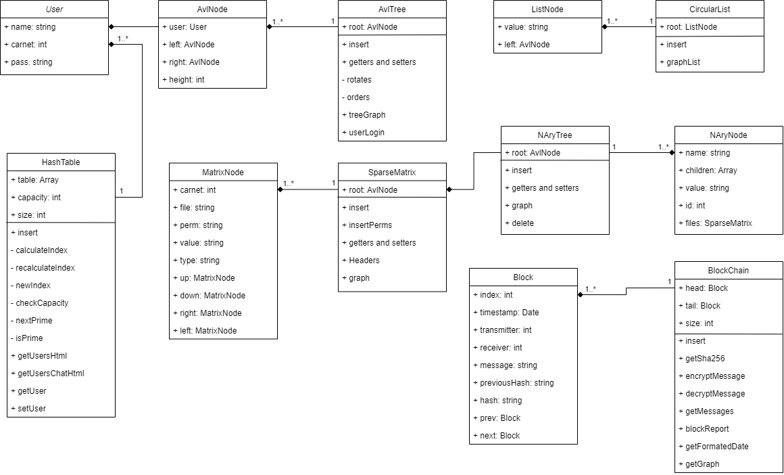
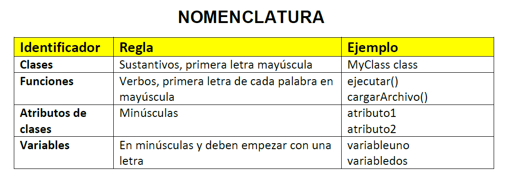
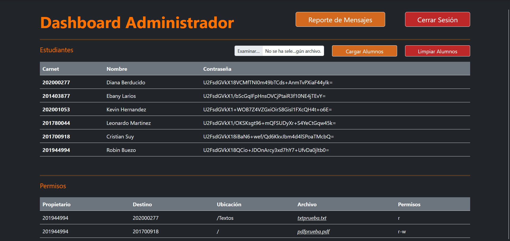
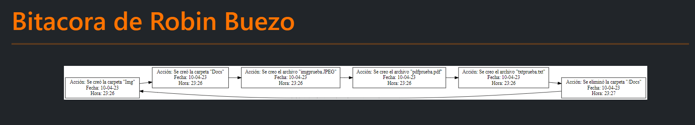
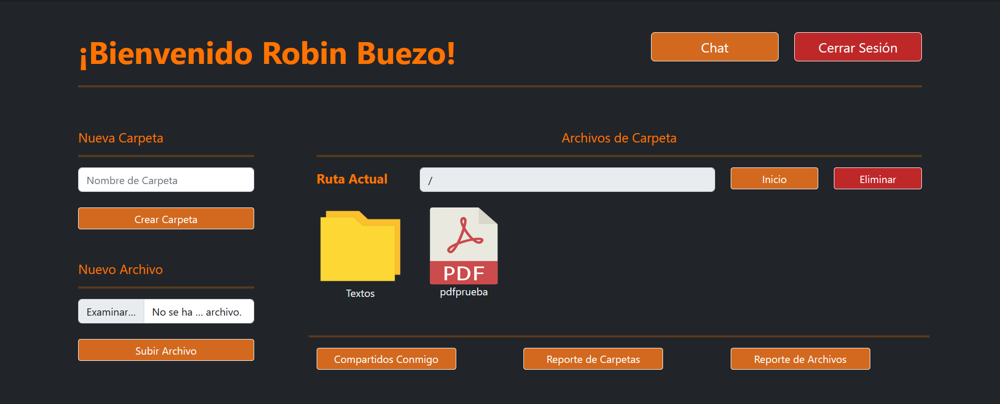
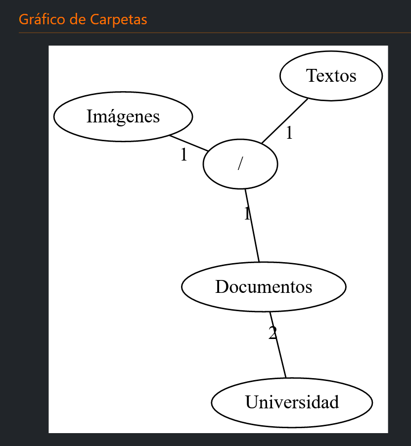
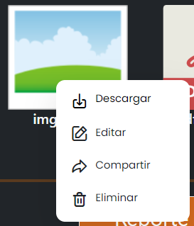
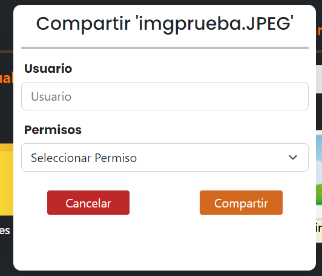
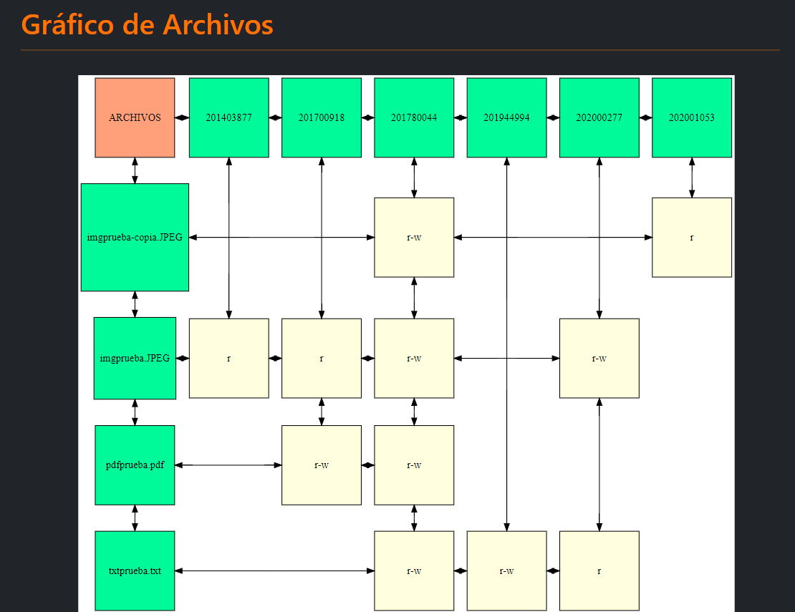

*Universidad de San Carlos de Guatemala*  
*Escuela de Ingeniería en Ciencias y Sistemas, Facultad de Ingenieria*  
*Estructuras de Datos, 1er. Semestre 2023.*  

___
## **PROYECTO FASE 2**
### **EDD GoDrive**
___
**201944994 - Robin Omar Buezo Díaz**  

#### **Resumen**
Esta aplicación está desarrollado por requerimientos de la Facultad de Ingeniería de la Universidad de San Carlos de Guatemala.

Estos requerimientos consisten en un sistema que pueda utilizarse en cualquier sistema operativo y que consista en un sistema de archivos y almacenamiento que pueda llevar un control de sus usuarios los cuales podran crear, eliminar o actualizar archivos y carpetas que estén relacionados a los distintos cursos.
___
#### **Introducción**  
El presente documento tiene como finalidad mostrar al usuario la funcionalidad y desarrollo del software para que entienda su construcción y pueda dar solución a cualquier error que pueda presentarse.  

Se explican el flujo y las diferentes partes que lo constituyen y cómo debemos de interactuar con este para que nos sea de gran ayuda y podamos sacarle el máximo provecho a nuestra herramienta.
___
___
## **Manual Técnico**

#### **Paradigma de Programación**
Para la creación se este software se utilizó el paradigma de Programación Orientada a Objetos, ya que esto da una mejor facilidad a la hora de manejar el archivo que se está manipulando a lo largo de toda la ejecución, como también el poder encapsular los objetos y luego poder utilizar los mismos objetos en los diferentes menús que se utilizan a lo largo del programa.

#### **Diagrama de Clases**  
 

#### **Nomenclatura**  
  

#### **Estructuras (TDA)**  
Para poder ir guardando la información necesaria en el sistema se hizo uso de algunas Estructuras, estas fueron creadas a lo largo de desarrollo haciendo uso de las clases que encapsulan los nodos de cada una de estas y las clases que encapsula las propias estructura. 

Entre las Estructuras utilizados están:
- Un Árbol AVL. 
- Una Lista Circular. 
- Un Árbol N-ario.
- Una Matriz Dispersa. 

##### ***Nodo de Árbol AVL (AvlNode)***
Este nodo se utilizó para poder formar e iterar el Árbol AVL en el cual se registran a todos los usuarios que están en el sistema.

Su "*Constructor*" es el siguiente:

~~~
class AvlNode{
    constructor(user){
        this.user = user;
        this.left = null;
        this.right = null;
        this.height = 0;
    }
}
~~~

##### ***Nodo de Lista Circular (ListNode)***
Este nodo se utilizó para poder formar e iterar la lista Circular en la cual se registran las acciones de los usuarios y funciona por ende como una bitácora.

Su "*Constructor*" es el siguiente:

~~~
class ListNode {
  constructor(value) {
    this.value = value;
    this.next = null;
  }
}
~~~

##### ***Nodo del Árbol N-ario (NAryTree)***
Este nodo se utilizó para poder formar e iterar el Árbol N-ario en el cual se registran y controlan todas las carpetas que cada usuario tiene.

Su "*Constructor*" es el siguiente:

~~~
class NAryNode {
    constructor(folderName) {
        this.name = folderName;
        this.children = [];
        this.id = null;
        this.files = new SparseMatrix();
    }
}
~~~

##### ***Nodo Matriz Dispersa (MatrixNode)***
Este nodo se utilizo para poder formar e iterar las matrices que se encuetran en cada carpeta "*NAryNode*".

Su "*Constructor*" es el siguiente:

~~~
class MatrixNode{
    constructor(carnet, file, perm, name, value, type){
        this.carnet = carnet;
        this.file = file;
        this.perm = perm;
        this.name = name;
        this.value = value;
        this.type = type;

        this.up = null;
        this.down = null;
        this.right = null;
        this.left = null;
    }
}
~~~

##### ***Árbol AVL (AvlTree)***
Esta "*Clase*" se utilizó para poder manipular los nodos de Usuarios y así poder crear el Árbol AVL.

Su "*Constructor*" es el siguiente:

~~~
class AvlTree{
    constructor(){
        this.root = null;
    }

    getHeight(node){
        return node === null ? -1 : node.height;
    }

    getMaxHeight(rightnode, leftnode){
        return leftnode > rightnode ? leftnode : rightnode;
    }

    Insert(user){
        this.root = this.#insertRecursive(user, this.root);
    }
}
~~~

##### ***Lista Circular (CircularList)***
Esta "*Clase*" se utilizó para poder manipular los nodos de la bitácora de los usuarios y así poder crear la Lista Circular.

Su "*Constructor*" es el siguiente:

~~~
class CircularList{
    constructor(){
        this.root = null;
    }
}
~~~

##### ***Árbol N-ario (NAryTree)***
Esta "*Clase*" se utilizó para poder manipular los nodos de las carpetas de los usuarios y así poder crear el Árbol N-ario.

Su "*Constructor*" es el siguiente:

~~~
class NAryTree{
    constructor(){
        this.root = new NAryNode('/');
        this.root.id = 0;
        this.size = 1;
    }
}
~~~

##### ***Matriz Dispersa (SparseMatrix)***
Esta "*Clase*" se utilizó para poder manipular los nodos de los archivos de los usuarios y también los permisos sobre estos y así poder crear la Matriz Dispersa.

Su "*Constructor*" es el siguiente:

~~~
class SparseMatrix{
    constructor(){
        this.root = new MatrixNode(null, null, "DOCUMENTOS", null, null, null);
    }
}
~~~

Cabe mencionar que cada una de estas Estructuras cuentan con todas o alguans de sus funciones principales para poder *insertar datos, buscar, ordenar *e* imprimir*, así mismo también la función que se encarga de gráficar a cada una.

Ademas de estas estructuras tenemos otra clase se encarga de guardar los datos de los usuarios.

##### ***Usuario (User)***
Esta "*Clase*" se utilizó para poder manipular y encapsular a los usuarios.

Su "*Constructor*" es el siguiente:

~~~
class User{
    constructor(firstn, lastn, carnet, pass){
        this.firstname = firstn;
        this.lastname = lastn;
        this.carnet = carnet
        this.pass = pass;
        this.folders = new NAryTree();
        this.binnacle = new CircularList();
    }
}
~~~

---

#### **Funciones Principales**
Luego de las estructuras se creó un archivo *"JavaScript"* para cada una de las ventanas *(Archivos HTML)* y un archivo *"CSS"* en el cual se manejó el diseño en general de las páginas.

Entre los archivos Principales de funciones contamos con los siguientes:  

##### ***index.js***
Este archivo es el que se encarga de manejar la funcionalidad de la venta principal de ingreso al sistema, su función principal es la de realizar el Login del Usuario o del Administrador y redirigirlos a su respectivo Dashboard.

##### ***admin.js***
Este archivo es el que se encarga de manejar la funcionalidad de la ventana del Dashboard del Administrador, entre sus funciones principales se encuentra las de *cargar usuarios, generar reporte de usuarios(Árbol AVL) y generar reporte de Bitácora por usuario (Lista Circular)*.

##### ***dashUser.js***
Este archivo es el que se encarga de manejar la funcionalidad de la ventana del Dashboard del Usuario, es quizá el archivo mas extenso por la gran cantidad de funcionalidades que se encuentran en esta ventana, entre sus funciones principales se encuentra las de *crear y eliminar carpetas, cargar archivos, compartir archivos, generar reporte de Carpetas (Árbol N-ario) y generar reporte de Archivos (Matriz Dispersa)*.

##### ***userGraph.js***
Este archivo es el que se encarga de manejar la funcionalidad de la ventana donde el administrador puede visualizar el reporte de usuarios.

##### ***binnacleGraph.js***
Este archivo es el que se encarga de manejar la funcionalidad de la ventana donde el administrador puede visualizar la bitácora de cada usuario.

##### ***foldersGraph.js***
Este archivo es el que se encarga de manejar la funcionalidad de la ventana donde el usuarios puede visualizar el reporte de sus carpetas.

##### ***filesGraph.js***
Este archivo es el que se encarga de manejar la funcionalidad de la ventana donde el usuarios puede visualizar el reporte de sus archivos y los permisos de cada uno.

#### **Herramientas**
Para poder dar solución a los requerimientos anteriores se utilizó el lenguaje de programación *JavaScript* y su documentación por su versatilidad en el uso de clases y fácil programación web.

Para poder generar la interfaz de las diferentes ventanas del sistema se utilizó el lenguaje de marcado *HTML*

Para poder dar el diseño respectivo a cada una de las ventanas de hizo uso del lenguaje de hojas de estilo en cascada *CSS*

Como herramienta de programación se utilizó el programa Visual Studio Code por su amplia funcionalidad y herramientas que brinda a los programadores a la hora de programar en cualquier lenguaje.  

Para poder realizar los diagramas y reportes se utilizó la herramienta Graphviz por su facilidad para poder desarrollar grafos potentes y entendibles.  

Para poder realizar este documento de utilizó el Lenguaje de marcado Markdown por su manera sencilla de generar documentos de escritura de facil lectura tanto en paginas web como en editores de texto.

Por último, se utilizó la herramienta de versionamiento GitHub. Para poder tener un mejor control sobre los cambios que se iban realizando en nuestro código y no tener el problema de perder funcionalidad si en caso algún cambio ocasionaba erros.
___
___

## **Manual de Usuario**

#### **Pantallas Principales**
##### ***Login***
Esta es la pantalla principal de inicio de sesión.
  

##### ***Dashboard Administrador***
Esta es la pantalla del usuario *"Admin"*.
  

##### ***Usuarios***
Esta es la pantalla en donde se puede visualizar el reporte de usuarios.
 

##### ***Bitácora***
Esta es la pantalla en donde se puede visualizar el reporte de bitacora de cada usuario.
 

##### ***Dashboard Usuario***
Esta es la pantalla principal del usuario.
 

##### ***Carpetas***
Esta es la pantalla donde se puede visualizar el reporte de carpetas.
 

##### ***Opciones de archivos***
Esta es el menú al dar click derecho sobre los archivos.
 

##### ***Compartir Archivos***
Esta es la ventana para poder compartir los archivos con otros usuarios.
 

##### ***Archivos***
Esta es la ventana en donde se puede visualizar el reporte de archivos y sus permisos.
 

##### ***Archivo JSON de los Estudiantes***
Esta es la estructura que debe tener el archivo JSON para la carga de los usuarios.
~~~
{
    "alumnos": [
        {
            "nombre": "Leonardo Martinez",
            "carnet": 20178004,
            "password": "leo1234",
            "Carpeta_Raiz": "/"
        },
        {
            "nombre": "Roberto Solorzano",
            "carnet": 201103656,
            "password": "salu2",
            "Carpeta_Raiz": "/"
        },
        {
            "nombre": "Estuardo Ruiz",
            "carnet": 201503336,
            "password": "est1998",
            "Carpeta_Raiz": "/"
        },
        {
            "nombre": "Cristian Suy",
            "carnet": 201709018,
            "password": "cris1234",
            "Carpeta_Raiz": "/"
        },
        {
            "nombre": "Ricardo Hernandez",
            "carnet": 202002535,
            "password": "holamundo",
            "Carpeta_Raiz": "/"
        }
    ]
}
~~~